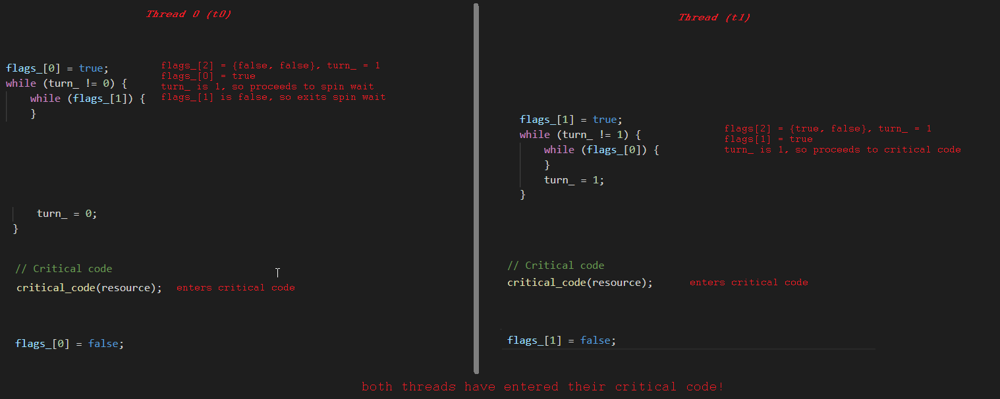

# Technical Challenge

You are tasked with advising about and implementing an algorithm for controlling access to a shared resource. This algorithm is intended to be deployed into a safety critical real time environment. 

# Build Instructions

## Windows

### Build Prerequisites

* [CMake, at least 3.13](https://cmake.org/)
* [Visual Studio 2019, Community Edition is sufficient](https://visualstudio.microsoft.com/)
* Windows 10

### Build Steps

1. Install CMake (minimum version 3.13).
2. Install Visual Studio 2019.
3. Run CMake inside `gerald.chau` dir and produce a Visual Studio .sln solution in a target directory. Target `x64` architecture.
4. Open Visual Studio solution `technical_challenge.sln`.
5. Compile for Release mode (`Ctrl+Shift+B`).
6. Set `test` as `Startup Project`.
7. Run `test` project (`F5`).
8. Confirm via console that Catch2 test passes.

## Docker

There's an experimental Dockerfile that will generate a project, compile using gcc and execute tests to console that I've added. I say experimental as I've been using MSVC locally to debug and implement my solution.

### Build Prerequisites

* [Docker](https://www.docker.com/)

### Build Steps

1. Install Docker.
2. `cd` to `gerald.chau` dir.
3. Run `docker build -t gerald.chau:latest .`. This will build a Docker image tagged `gerald.chau:latest`. CMake and compilation will be displayed in console while building the image.
4. Run container `docker run--rm -it gerald.chau:latest`.
5. Confirm via console that Catch2 test passes.

# Test

Catch2 is used to test the concepts. I've included it in here (along with the Boost license) for ease of deployment.

# Questions
## Analysis
`Provide an analysis of correctness of the given algorithm.`

The algorithm specified in the Technical Challenge suffers from TOC TOU ([Time-of-check to time-of-use](https://en.wikipedia.org/wiki/Time-of-check_to_time-of-use)) problem. This is a race condition introduced between both threads vying for the same resource for exclusive access. The algorithm makes use of two variables:

1. `flags[2]` - Indicates each thread's desire to enters its critical code. The 0th index indicates thread 0 and 1st index indicates thread 1.
2. `turn` - Indicates which thread's turn it is to enter its critical code. Turn of value 0 indicates that it is thread 0's turn to enter its critical code, and turn of value 1 indicates that it is thread 1's turn to enter its critical code.

The issue with the algorithm is that between thread 0 and thread 1 (which I will call `t0` and `t1`, respectively), is that there is a possibility that both `t0` and `t1` can simultaneously enter their critical code. In between the time for a thread exiting the spin-wait and set the `turn` variable to its own index, the other thread can enter its critical code.

1. Both `flags` values are set to false.
2. `turn` is set to 1.
3. `t0` sets `flags[0]` to true.
4. `t0` checks if it's `t0`'s turn to enter the critical code. It is not, so it enters the while loop.
5. `t0` checks if `t1` has raised its flag to enter the critical code. It is not raised, so `t0` exits its spin-wait.
6. `t1` sets `flags[1]` to true.
7. `t1` checks if it's `t1`'s turn to enter the critical code. It is, so it enters its critical code.
8. `t0` sets `turn` to 0.
9. `t0` enters its critical code.

Between the time of `t0` checking `flags[1]` and setting `turn` to 0, `t1` can slip in without spin waiting and entering the critical code.

A diagram with code below for a visual explanation.

## Alternative Strategies
`Give suggestions on alternative methods to give exclusive access to processes in safety critical environments (real time features? other?)`

### Correctness
The algorithm can be modified to be an implementation of Peterson's Algorithm / Lock. The thread will raise their respective flag when they desire to enter their critical code. However, the twist here, is that the thread will yield their turn to the other thread by setting `turn` to the other thread's turn value. Now, the thread will spin wait if both `turn` is set to the other thread's turn, and the other thread's flag is raised. Once either condition is not satisfied, this indicates:

* `turn` has been set to this thread's turn by the other thread. This indicates the other thread has yielded its turn to this thread.
* The other thread's flag has been lowered. This indicates that the other thread no longer wants to enter its critical code, thus allowing this thread to enter its critical code.

As both `flags` and `turn` are set before the spin wait, the TOC TOU issue has been avoided. This avoids the issue where there is a window of opportunity before `turn` can be updated for the other thread to slip in and execute its critical code. `turn` is assigned before the spin wait, and yields its turn to the other thread. This ensures that if the other thread wants to enter its critical section, it will do so (taking priority), forcing this thread to wait until the other thread has completed its critical code. The other thread signals its exit by lowering its flag, thus allowing this thread to enter its critical code.

### Real Time
To modify this algorithm to satisfy real time constraints, the algorithm must be able to guarantee a response within a time frame or be able to pause and resume critical code on demand due to an interrupt. Adding the following constraints to the critical code would enable it to satisfy real time conditions:

* Allow state to be cached / pushed onto a stack when an interrupt happens, and pause the algorithm. Switch context to handle interrupt, and resume algorithm once interrupt has been resolved. This is to avoid unfinished work / processing on said resource, which could lead to undefined behaviour.
* Constrain critical code section to a limited time (milliseconds or microseconds, depending on unit of time required) or number of cycles - yield critical code once a certain threshold has been reached to allow the other thread access if necessary (if thread fairness is required).

If `t0` and `t1` are not equal priority, yield access to the higher priority thread to critical section if necessary.

### Scalability
This algorithm can only be used for 2 threads (due to the binary use of turn), thus it is not suitable for scaling to > 2 threads. Using an algorithm such as the Filter Lock or [Bakery Lock](https://en.wikipedia.org/wiki/Lamport%27s_bakery_algorithm) algorithm will accommodate multiple threads.

## Evidence Formation
`Provide details on how to create evidence that the algorithm (the given one or an alternative one) behaves correctly (tests? formal methods?).`

In my implementation, for the given algorithm (dubbed `spec_exclusive_access`), I have added a unit test to exhibit the race condition. Although crude, it does show that there is an inconsistency in the correctness of this algorithm. The test dispatches 2 threads to increment an integer counter by 1 as its critical section. I expect each thread to iterate `N` number of times, to sum the counter to `N * 2` value. Given that this is testing a race condition, the test does not always show signs of incorrectness. I have increased the chances of a race condition by increasing N to 6 significant digits, and running the test for 10 seconds on loop. The test expects the integer counter to not equal my expected `N * 2` value. There is a chance for this test to fail (no race condition occurs).

The same test is implemented for the corrected version (dubbed `fixed_exclusive_access`), where I expect is `N * 2` to be correct on every iteration for the 10 second loop the test is executed.

## Implementation
`Implement the algorithm (the given one, or the one that you suggest as an alternative) as a production ready distributable library in C++. `

Please refer to `CMakeLists.txt` file and src for implementation. For simplicity, responsibility of creation and ownership of shared resource is handled externally. There may be a desire to wrap the resource in this class to only allow access to the resource via critical code, depending on the context, if this is required.

* The implementation of this algorithm can be seen in `src/lib/resource_access.h`, in class `spec_exclusive_access`. This class has an associated test in `src/test/spec_exclusive_access_test.cpp`. 
* The implementation of improved algorithm can be seen in `src/lib/resource_access.h`, in class `fixed_exclusive_access`. This class has associated tests in `src/test/fixed_exclusive_access_test.cpp`.

# References

* https://en.wikipedia.org/wiki/Peterson%27s_algorithm
* https://en.wikipedia.org/wiki/Time-of-check_to_time-of-use
* https://en.wikipedia.org/wiki/Real-time_computing
* https://en.wikipedia.org/wiki/Lamport%27s_bakery_algorithm
* https://github.com/catchorg/Catch2
* https://cmake.org/
* https://visualstudio.microsoft.com/
* https://www.docker.com/